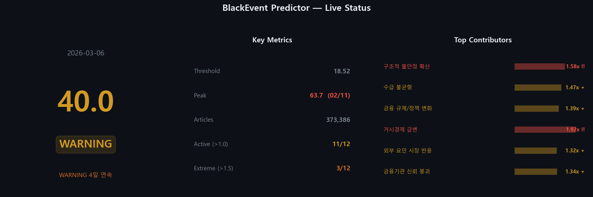
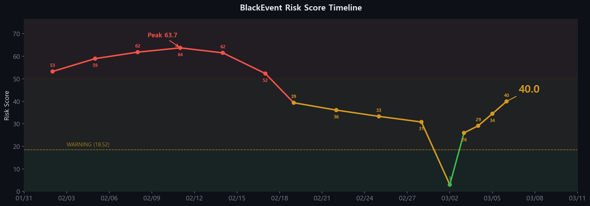
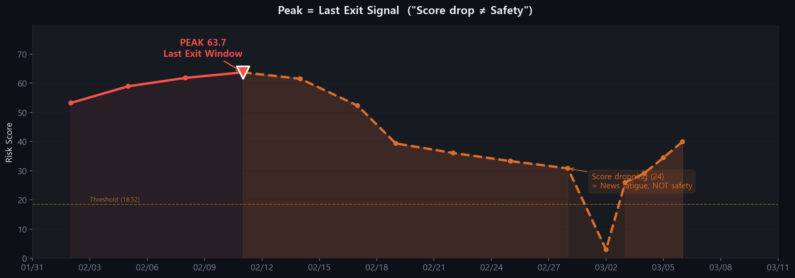
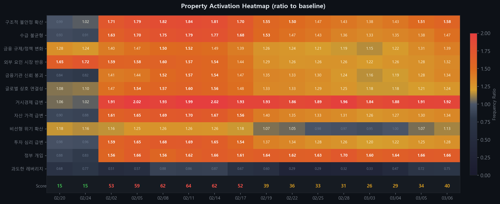

# BlackEvent Predictor — Dashboard

> Last updated: **2026-03-06** | Auto-generated by `python -m src.dashboard.generate`

---

## Current Status

---

## Risk Score Timeline

---

## Peak = Last Exit Signal

> 스코어 고점의 높이가 후속 충격의 강도와 시급성을 예고한다.
> 고점에서 하락하는 구간은 안전 신호가 아니라 **트리거 대기 구간**이다.

---

## Property Activation Heatmap

> 12개 유의미 성질의 빈도 비율. 1.0 = baseline, 1.5+ = 극강 신호.

---

## Reading Guide

| Score Range | Status | Meaning |
|:-----------:|:------:|---------|
| 0 ~ 18.5 | NORMAL | Baseline risk level |
| 18.5 ~ 40 | WARNING | Elevated structural stress |
| 40 ~ 60 | WARNING | High risk — event likely within months |
| 60+ | WARNING | Extreme — event likely within weeks |

| Peak → Drop Pattern | Interpretation |
|---------------------|----------------|
| Score rising | Structural vulnerability accumulating |
| **Score at peak** | **Last exit window** |
| Score dropping | News fatigue — NOT improvement |
| Score dropping + still above threshold | Trigger imminent |

---

> This dashboard is auto-generated from model outputs. Not financial advice.
>
> See [`insight_2026-03-04_iran_crisis.md`](data/outputs/insight_2026-03-04_iran_crisis.md) and
> [`insight_2026-03-07_peak_exit_signal.md`](data/outputs/insight_2026-03-07_peak_exit_signal.md)
> for detailed analysis.
